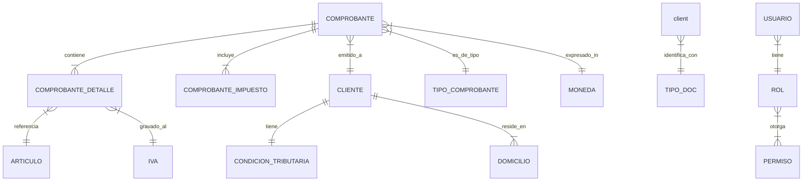

# Mapa de Dominio

## Entidades Principales

### Facturación y Comprobantes
- **Comprobante**: Entidad central. Representa una factura, nota de débito, nota de crédito, recibo, etc.
  - *Relaciones*: Cliente, Items (Detalle), Impuestos, Estado (Draft, Emitido, Anulado).
- **ComprobanteDetalle**: Ítem individual dentro de un comprobante.
- **ComprobanteImpuesto**: Registro de tributos aplicados al comprobante (IVA, Percepciones).
- **TipoComprobante**: Clasificación fiscal (Factura A, B, C, etc.).
- **Voucher**: Posiblemente relacionado con pagos o movimientos de caja.

### Sujetos Comerciales
- **Cliente**: Receptor de los comprobantes.
  - *Atributos*: Razón Social, CUIT/DNI, Domicilio, Condición Fiscal (Resp. Inscripto, Monotributo, etc.).
- **Usuario**: Operador del sistema.
- **Rol / Permisos**: Gestión de acceso (`Rol`, `RolMenuItem`, `MenuItem`).

### Referencias Fiscales (AFIP)
- **IVA (Impuesto al Valor Agregado)**: Tasas aplicables (21%, 10.5%, etc.).
- **CondicionTributaria**: Categorización fiscal del contribuyente.
- **TipoDoc**: DNI, CUIT, CUIL, Pasaporte.
- **Moneda**: Pesos Arg, Dólares, etc. cotizaciones.
- **Concepto**: Tipo de facturación (Productos, Servicios, Ambos).

### Ubicación Geográfica
- **Pais**
- **Provincia**
- **Localidad**
- **Domicilio**

### Financiero
- **CuentaCorriente**: Gestión de saldos de clientes.
- **Articulo**: Catálogo de productos/servicios facturables.

## Diagrama de Relaciones Simplificado

## Ciclo de Vida Inferido (Factura)
1. **Borrador/Preparación**: Creación interna, validación de datos negocio.
2. **Solicitud CAE**: Envío a AFIP para autorización.
3. **Emitido/Aprobado**: AFIP devuelve CAE. El comprobante es legalmente válido.
4. **Rechazado**: AFIP rechaza por inconsistencias (CUIT inválido, fechas, etc.).
5. **Anulado**: Mediante Nota de Crédito (fiscalmente no se elimina, se compensa).
